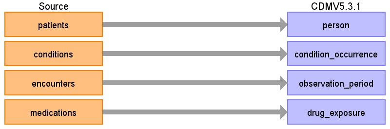
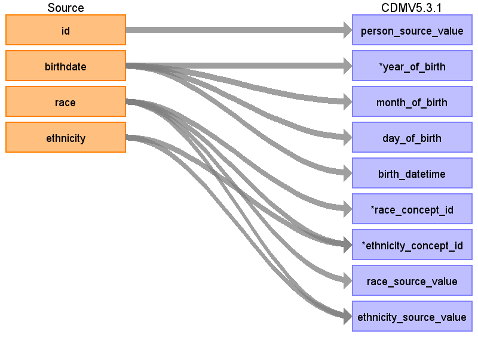

# Source Data Mapping Approach to CDMV5.3.1

## Table name: person

### Reading from patients

| Destination Field | Source field | Logic | Comment field |
| --- | --- | --- | --- |
| person_id |  |  |  |
| person_source_value | id |  |  |
| gender_concept_id |  |  |  |
| year_of_birth | birthdate | only Year of birthdate YYYY |  |
| month_of_birth | birthdate | only Month of birthdate MM |  |
| day_of_birth | birthdate | only Day of birthdate DD |  |
| birth_datetime | birthdate | complete datetime of birthdate YYYY-MM-DD.HH.MM.SS |  |
| race_concept_id | race | when you see:   + white  = 8527   + black  = 8516   + else    = 0   - just a the number equals with as concept id |  |
| ethnicity_concept_id | race  ethnicity | when you see:   + hispanic = 38003562   + else        = 0 |  |
| location_id |  |  |  |
| provider_id |  |  |  |
| care_site_id |  |  |  |
| gender_source_value |  |  |  |
| gender_source_concept_id |  |  |  |
| race_source_value | race |  |  |
| race_source_concept_id |  |  |  |
| ethnicity_source_value | race  ethnicity |  |  |
| ethnicity_source_concept_id |  |  |  |

## Table name: condition_occurrence

### Reading from conditions

| Destination Field | Source field | Logic | Comment field |
| --- | --- | --- | --- |
| person_id | patient | kook up in the person table |  |
| condition_occurrence_id |  |  |  |
| condition_start_date | start |  |  |
| condition_start_datetime | start |  |  |
| condition_end_date | stop |  |  |
| condition_end_datetime | stop |  |  |
| condition_type_concept_id |  |  |  |
| stop_reason |  |  |  |
| provider_id |  |  |  |
| visit_occurrence_id | encounter |  |  |
| visit_detail_id |  |  |  |
| condition_concept_id | code | looup the conept id regarding the given code (is SNOMED already) |  |
| condition_source_value | code |  |  |
| condition_source_concept_id | code |  |  |
| condition_status_source_value |  |  |  |
| condition_status_concept_id |  |  |  |

## Table name: observation_period

### Reading from encounters

| Destination Field | Source field | Logic | Comment field |
| --- | --- | --- | --- |
| observation_period_id |  |  |  |
| person_id | patient | look up in person table using patient |  |
| observation_period_start_date | start |  |  |
| observation_period_end_date | stop | man(stop) |  |
| period_type_concept_id |  |  |  |

## Table name: drug_exposure

### Reading from medications

| Destination Field | Source field | Logic | Comment field |
| --- | --- | --- | --- |
| person_id | patient | lookup in the person table |  |
| drug_exposure_id |  |  |  |
| drug_exposure_start_date | start |  |  |
| drug_exposure_start_datetime | start |  |  |
| drug_exposure_end_date | stop |  |  |
| drug_exposure_end_datetime | stop |  |  |
| stop_reason |  |  |  |
| verbatim_end_date | stop |  |  |
| drug_concept_id | code | lookup the concept id regarding the given code (its already SNOMED) |  |
| drug_source_concept_id | code |  |  |
| drug_source_value | description |  |  |
| drug_type_concept_id |  |  |  |
| refills |  |  |  |
| quantity |  |  |  |
| days_supply |  |  |  |
| sig |  |  |  |
| route_concept_id |  |  |  |
| lot_number |  |  |  |
| provider_id |  |  |  |
| visit_occurrence_id |  |  |  |
| visit_detail_id |  |  |  |
| route_source_value |  |  |  |
| dose_unit_source_value |  |  |  |

## Table name: device_exposure

## Table name: death

## Table name: fact_relationship

## Table name: measurement

## Table name: note

## Table name: note_nlp

## Table name: observation

## Table name: procedure_occurrence

## Table name: specimen

## Table name: visit_detail

## Table name: visit_occurrence

## Table name: cohort

## Table name: cohort_attribute

## Table name: condition_era

## Table name: dose_era

## Table name: drug_era

## Table name: cost

## Table name: payer_plan_period

## Table name: care_site

## Table name: location

## Table name: provider

## Table name: cdm_source

## Table name: metadata

## Table name: attribute_definition

## Table name: cohort_definition

